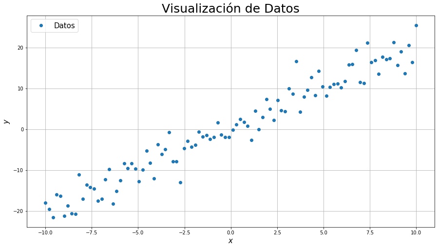
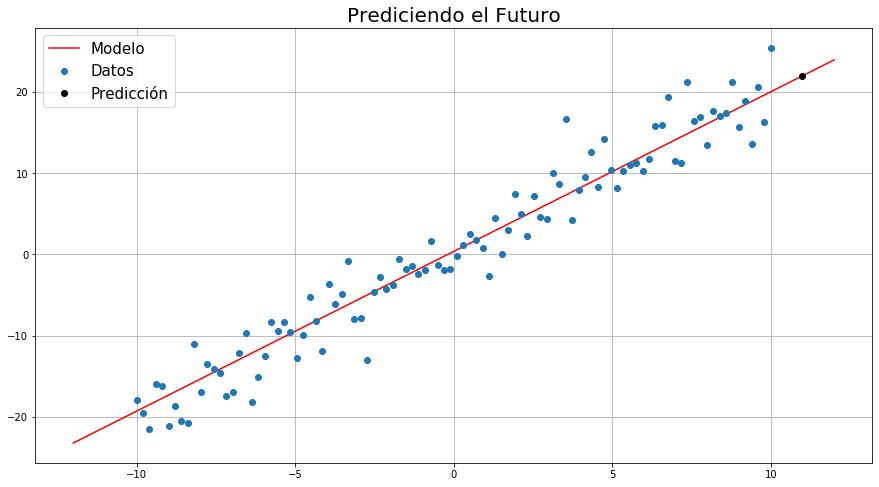

<a id='TOC'></a>
# Tabla de Contenidos

[Construyendo Red](#construye_red)

# **Importando Librerías Necesarias**


```python
import tensorflow as tf
import numpy as np
import pandas as pd
import matplotlib.pyplot as plt
from tensorflow import keras
```

# **Simulando Datos**


```python
np.random.seed(23)
# Crear Eje x
x=np.linspace(-10,10,100)
#Crear Observaciones
y=2*x+3*np.random.normal(0,1,size=len(x))

#Crear DataFrame
datos=pd.DataFrame(np.vstack((x,y)).T, columns=['x','y'])
#Ver datos
datos
```


<div>
<style scoped>
    .dataframe tbody tr th:only-of-type {
        vertical-align: middle;
    }

    .dataframe tbody tr th {
        vertical-align: top;
    }

    .dataframe thead th {
        text-align: right;
    }
</style>
<table border="1" class="dataframe">
  <thead>
    <tr style="text-align: right;">
      <th></th>
      <th>x</th>
      <th>y</th>
    </tr>
  </thead>
  <tbody>
    <tr>
      <th>0</th>
      <td>-10.000000</td>
      <td>-17.999036</td>
    </tr>
    <tr>
      <th>1</th>
      <td>-9.797980</td>
      <td>-19.518520</td>
    </tr>
    <tr>
      <th>2</th>
      <td>-9.595960</td>
      <td>-21.524777</td>
    </tr>
    <tr>
      <th>3</th>
      <td>-9.393939</td>
      <td>-15.941977</td>
    </tr>
    <tr>
      <th>4</th>
      <td>-9.191919</td>
      <td>-16.278823</td>
    </tr>
    <tr>
      <th>...</th>
      <td>...</td>
      <td>...</td>
    </tr>
    <tr>
      <th>95</th>
      <td>9.191919</td>
      <td>18.960197</td>
    </tr>
    <tr>
      <th>96</th>
      <td>9.393939</td>
      <td>13.618120</td>
    </tr>
    <tr>
      <th>97</th>
      <td>9.595960</td>
      <td>20.575697</td>
    </tr>
    <tr>
      <th>98</th>
      <td>9.797980</td>
      <td>16.339859</td>
    </tr>
    <tr>
      <th>99</th>
      <td>10.000000</td>
      <td>25.470135</td>
    </tr>
  </tbody>
</table>
<p>100 rows × 2 columns</p>
</div>


# **Visualizar Datos**


```python
plt.figure(figsize=(15,8))
plt.title("Visualización de Datos",fontsize=25)
plt.plot(x,y,'o')
plt.legend(["Datos"],fontsize=15)
plt.xlabel("$x$",fontsize=15)
plt.ylabel("$y$",fontsize=15)
plt.grid()
plt.show()
```





<a id='construye_red'></a>
# **Construyendo Red Neuronal (Modelamiento/Diseño)**
[Contenido](#TOC)


```python
# Crear Modelo (Diseño/Arquitectura)

model = keras.Sequential([
    keras.layers.Dense(units=1,input_shape=(1,))
])
```

# **Compilando Red Neuronal**


```python
# Compilar Modelo

model.compile(optimizer='sgd', loss='mean_squared_error')
```

# **Mirando el Resumen de la Red Neuronal**


```python
# Resumen para tener control de los parámetros a "entrenar"
model.summary()
```

    Model: "sequential_3"
    _________________________________________________________________
    Layer (type)                 Output Shape              Param #   
    =================================================================
    dense_3 (Dense)              (None, 1)                 2         
    =================================================================
    Total params: 2
    Trainable params: 2
    Non-trainable params: 0
    _________________________________________________________________


# **Entrenando Red Neuronal (Fancy para "Hacer la Regresión")**


```python
model.fit(x, y, epochs=100,verbose=0)
```


    <tensorflow.python.keras.callbacks.History at 0x7fc5c424dbd0>


# **Visualizar Resultados de la Red**


```python
#Obtener Pesos de la Red
w=model.get_weights()

print("\nObjeto Pesos:",w)
print('\nNumber of Weights -> '+ str(len(w)))
print('\nw1 = ' + str(w[0][0]) +'(Weight)')
print('w0 = ' + str(w[1])+'("Weight"->Bias)')
print('\nThe Model is: y = w1*x+w0:')
print('\ny = {}*x+{}'.format(w[0].item(),w[1].item()))

# Crear Modelo a las Malas
x = np.linspace(x[0],x[-1],100)
# Anonymous Function
reg = lambda x: np.transpose(w[0]*x+w[1])
```

    
    Objeto Pesos: [array([[1.967447]], dtype=float32), array([0.36357442], dtype=float32)]
    
    Number of Weights -> 2
    
    w1 = [1.967447](Weight)
    w0 = [0.36357442]("Weight"->Bias)
    
    The Model is: y = w1*x+w0:
    
    y = 1.96744704246521*x+0.36357441544532776


# **Predecir valores DENTRO de los datos (Ver Regresión)**


```python
plt.figure(figsize=(15,8))
plt.plot(x,reg(x),'r-',label='Modelo: y={:.2f}x{:.2f}'.format(w[0].item(),w[1].item()))
plt.plot(x,y,'o', label='Datos')
plt.title('Plotting Model vs Data',fontsize=20)
plt.xlabel("$x$",fontsize=15)
plt.ylabel("$y$",fontsize=15)
plt.legend(loc=0,fontsize=15)
plt.grid()
plt.show()
```


# **Predecir valores FUERA de los datos (Usar Modelo)**


```python
# Predicción

#Punto fuera de los datos de entrenamiento (MUY IMPORTANTE)
x_test=[11.0]

# Predecir valor usando el Modelo generado del entrenamiento
pred = model.predict(x_test)
print(' La Predicción en x = 11 es '+str(pred))

# Aumentar Resolución del Modelo Fuera de los Datos
x_model=np.linspace(-12,12,100)


plt.figure(figsize=(15,8))
plt.plot(x_model,reg(x_model),'r-',label='Modelo')
plt.plot(x,y,'o', label='Datos')
plt.plot(x_test,pred,'ko', label='Predicción')
plt.title('Prediciendo el Futuro',fontsize=20)
plt.legend(loc=0,fontsize=15)
plt.grid()
plt.show()
```

     La Predicción en x = 11 es [[22.005493]]




